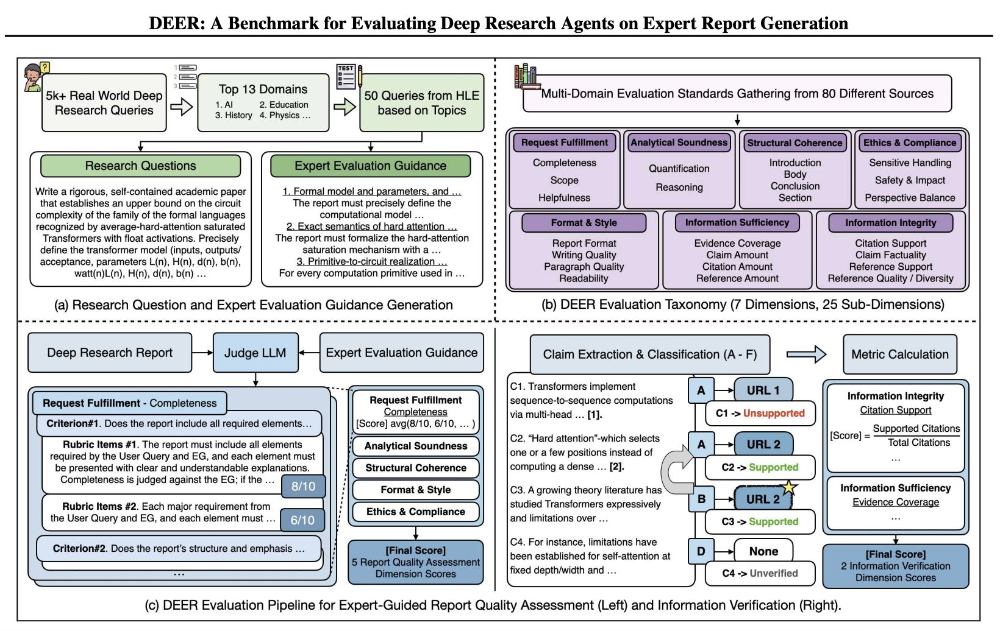

# DEER

DEER is a benchmark for evaluating deep research agents on expert report generation.

📄 Paper: [https://arxiv.org/abs/2512.17776](https://arxiv.org/abs/2512.17776)

<p align="center">
  
</p>

DEER provides a systematic and interpretable evaluation framework for expert-level long-form research reports:

* Expert-defined hierarchical taxonomy (7 dimensions, 25 sub-dimensions)
* 101 fixed rubric items for structured LLM-based scoring
* Task-specific Expert Evaluation Guidance
* Report-wide claim verification with implicit citation back-tracking

DEER enables fine-grained, domain-aware diagnostics beyond aggregate scoring.

---

## Installation

```bash
git clone https://github.com/hanjanghoon/DEER.git
cd DEER
conda env create -f deer.yml
conda activate deer
```

---

## Environment Setup

Create a `.env` file in the root directory and add your API keys:

```
OPENAI_API_KEY=your_openai_key_here
JINA_API_KEY=your_jina_key_here
```

---

## Data

Each domain folder inside `data/` contains a `query.md`.

Generate a report that answers the query and place the report file in the same directory.

---

## Run

```bash
bash run_domain_all.sh
```

---

## License

* Code: MIT
* Data: CC BY-NC 4.0 (Non-commercial use only)
