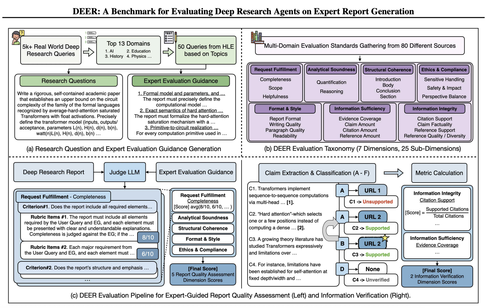

# DEER

DEER is a benchmark for evaluating deep research agents on expert report generation.

📄 Paper: [https://arxiv.org/abs/2512.17776](https://arxiv.org/abs/2512.17776)

<p align="center">
  
</p>

DEER provides a systematic and interpretable evaluation framework for expert-level long-form research reports:

* Expert-defined hierarchical taxonomy (7 dimensions, 25 sub-dimensions)
* 101 fixed rubric items for structured LLM-based scoring
* Task-specific Expert Evaluation Guidance
* Report-wide claim verification with implicit citation back-tracking

DEER enables fine-grained, domain-aware diagnostics beyond aggregate scoring.

---

## Installation

```bash
git clone https://github.com/hanjanghoon/DEER.git
cd DEER
conda env create -f deer.yml
conda activate deer
```

---

## Environment Setup

Create a `.env` file in the root directory and add your API keys:

```
OPENAI_API_KEY=your_openai_key_here
JINA_API_KEY=your_jina_key_here
```

---

## Data

Each domain folder inside `data/` contains a `query.md`.

Generate a report that answers the query and place the report file in the same directory.

---

## Run

```bash
bash run_domain_all.sh
```

---
<h2>Experimental Results</h2>

<table>
  <thead>
    <tr>
      <th align="left">Model</th>
      <th align="right">Request<br>Fulfillment</th>
      <th align="right">Analytic<br>Soundness</th>
      <th align="right">Structural<br>Coherence</th>
      <th align="right">Format &amp;<br>Style</th>
      <th align="right">Information<br>Integrity</th>
      <th align="right">Information<br>Sufficiency</th>
      <th align="right">Ethics</th>
      <th align="right">Mean</th>
    </tr>
  </thead>
  <tbody>
    <tr>
      <td colspan="9"><b>General LLMs (No Reasoning)</b></td>
    </tr>
    <tr>
      <td><nobr>Qwen3-235B</nobr></td>
      <td align="right">4.51</td>
      <td align="right">5.02</td>
      <td align="right">6.09</td>
      <td align="right">7.49</td>
      <td align="right">1.24</td>
      <td align="right">4.20</td>
      <td align="right">7.19</td>
      <td align="right">5.11</td>
    </tr>
    <tr>
      <td><nobr>Gemini 2.5 Flash</nobr></td>
      <td align="right">4.64</td>
      <td align="right">5.33</td>
      <td align="right">6.55</td>
      <td align="right">7.85</td>
      <td align="right">1.30</td>
      <td align="right">3.99</td>
      <td align="right">7.52</td>
      <td align="right">5.31</td>
    </tr>
    <tr>
      <td><nobr>Claude Opus 4.5</nobr></td>
      <td align="right">4.94</td>
      <td align="right">5.48</td>
      <td align="right">6.54</td>
      <td align="right">7.99</td>
      <td align="right">2.29</td>
      <td align="right">4.50</td>
      <td align="right">7.78</td>
      <td align="right">5.65</td>
    </tr>
    <tr>
      <td><nobr>GPT-5</nobr></td>
      <td align="right">4.11</td>
      <td align="right">4.75</td>
      <td align="right">5.84</td>
      <td align="right">7.21</td>
      <td align="right">1.05</td>
      <td align="right">3.13</td>
      <td align="right">7.30</td>
      <td align="right">4.77</td>
    </tr>

    <tr>
      <td colspan="9"><b>LLMs + Reasoning</b></td>
    </tr>
    <tr>
      <td><nobr>Qwen3-235B</nobr></td>
      <td align="right">5.00</td>
      <td align="right">5.33</td>
      <td align="right">6.64</td>
      <td align="right">7.88</td>
      <td align="right">1.12</td>
      <td align="right">3.90</td>
      <td align="right">7.38</td>
      <td align="right">5.32</td>
    </tr>
    <tr>
      <td><nobr>Gemini 2.5 Pro</nobr></td>
      <td align="right">4.88</td>
      <td align="right">5.81</td>
      <td align="right">6.99</td>
      <td align="right">8.09</td>
      <td align="right">2.23</td>
      <td align="right">4.40</td>
      <td align="right">7.73</td>
      <td align="right">5.73</td>
    </tr>
    <tr>
      <td><nobr>Claude Opus 4.5</nobr></td>
      <td align="right">4.96</td>
      <td align="right">5.48</td>
      <td align="right">6.68</td>
      <td align="right">8.10</td>
      <td align="right">2.27</td>
      <td align="right">4.22</td>
      <td align="right">7.73</td>
      <td align="right">5.63</td>
    </tr>
    <tr>
      <td><nobr>GPT-5</nobr></td>
      <td align="right"><b>5.57</b></td>
      <td align="right"><b>6.18</b></td>
      <td align="right"><b>7.00</b></td>
      <td align="right">8.06</td>
      <td align="right">2.11</td>
      <td align="right">4.16</td>
      <td align="right"><u>8.08</u></td>
      <td align="right">5.88</td>
    </tr>

    <tr>
      <td colspan="9"><b>LLMs + Reasoning + WebSearch</b></td>
    </tr>
    <tr>
      <td><nobr>Qwen3-235B</nobr></td>
      <td align="right">4.05</td>
      <td align="right">4.34</td>
      <td align="right">5.68</td>
      <td align="right">6.83</td>
      <td align="right">5.22</td>
      <td align="right">5.45</td>
      <td align="right">7.06</td>
      <td align="right">5.52</td>
    </tr>
    <tr>
      <td><nobr>Claude Opus 4.5</nobr></td>
      <td align="right">4.52</td>
      <td align="right">5.13</td>
      <td align="right">5.99</td>
      <td align="right">7.41</td>
      <td align="right"><u>7.03</u></td>
      <td align="right"><u>7.62</u></td>
      <td align="right">7.37</td>
      <td align="right">6.44</td>
    </tr>
    <tr>
      <td><nobr>GPT-5</nobr></td>
      <td align="right"><b>5.57</b></td>
      <td align="right"><u>6.08</u></td>
      <td align="right">6.97</td>
      <td align="right"><b>8.15</b></td>
      <td align="right">5.63</td>
      <td align="right">6.17</td>
      <td align="right"><b>8.11</b></td>
      <td align="right"><b>6.67</b></td>
    </tr>

    <tr>
      <td colspan="9"><b>Deep Research</b></td>
    </tr>
    <tr>
      <td><nobr>WebThinker</nobr></td>
      <td align="right">4.11</td>
      <td align="right">4.64</td>
      <td align="right">5.51</td>
      <td align="right">7.35</td>
      <td align="right">6.21</td>
      <td align="right">6.40</td>
      <td align="right">7.13</td>
      <td align="right">5.91</td>
    </tr>
    <tr>
      <td><nobr>Qwen3-235B</nobr></td>
      <td align="right">4.13</td>
      <td align="right">4.69</td>
      <td align="right">4.85</td>
      <td align="right">7.06</td>
      <td align="right">6.55</td>
      <td align="right"><b>7.90</b></td>
      <td align="right">7.43</td>
      <td align="right">6.09</td>
    </tr>
    <tr>
      <td><nobr>Gemini 2.5 Pro</nobr></td>
      <td align="right">4.71</td>
      <td align="right">5.37</td>
      <td align="right">6.25</td>
      <td align="right">7.59</td>
      <td align="right">6.01</td>
      <td align="right">7.61</td>
      <td align="right">7.39</td>
      <td align="right">6.42</td>
    </tr>
    <tr>
      <td><nobr>Claude Opus 4.5</nobr></td>
      <td align="right">4.53</td>
      <td align="right">5.22</td>
      <td align="right">5.69</td>
      <td align="right">7.22</td>
      <td align="right">6.04</td>
      <td align="right">5.66</td>
      <td align="right">7.57</td>
      <td align="right">5.99</td>
    </tr>
    <tr>
      <td><nobr>OpenAI</nobr></td>
      <td align="right">4.67</td>
      <td align="right">5.29</td>
      <td align="right">6.28</td>
      <td align="right">7.66</td>
      <td align="right"><b>7.14</b></td>
      <td align="right">6.89</td>
      <td align="right">7.48</td>
      <td align="right">6.49</td>
    </tr>
  </tbody>
</table>

---

## License

* Code: MIT
* Data: CC BY-NC 4.0 (Non-commercial use only)
