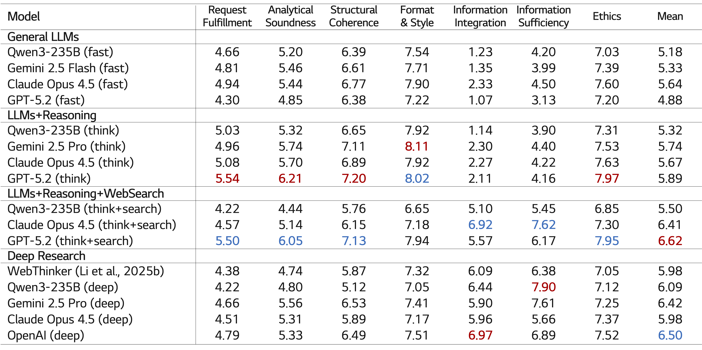

# DEER

DEER is a benchmark for evaluating deep research agents on expert report generation.

📄 **Paper:** [OpenReview](https://openreview.net/forum?id=ILRx5neJk6)
🏆 **Accepted at ICML 2026**
🤗 **Dataset:** [LG-AI-Research/DEER-Deep-Research-Benchmark](https://huggingface.co/datasets/LG-AI-Research/DEER-Deep-Research-Benchmark)

<p align="center">
  
</p>

Existing evaluations for Deep Research Agents often remain surface-level when assessing long-form expert reports. DEER enables evaluation from an expert perspective using 101 fine-grained rubrics and task-specific human expert evaluation guidance. It also links every factual statement in a report to relevant external evidence and verifies whether the content is actually grounded, enabling a more complete assessment of report reliability.

DEER provides a systematic and interpretable evaluation framework with:

* an expert-defined hierarchical taxonomy comprising 7 dimensions and 25 sub-dimensions;
* 101 fixed rubric items for structured LLM-based scoring;
* task-specific Expert Evaluation Guidance; and
* report-wide claim verification with implicit citation back-tracking.

DEER enables fine-grained, domain-aware diagnostics beyond aggregate scoring.

---

## Installation

```bash
git clone https://github.com/hanjanghoon/DEER.git
cd DEER
conda env create -f deer.yml
conda activate deer
```

---

## Environment Setup

Create a `.env` file in the project root and add the required API keys:

```text
OPENAI_API_KEY=your_openai_key_here
JINA_API_KEY=your_jina_key_here
```

---

## Data

The official DEER dataset is available on Hugging Face:

🤗 [LG-AI-Research/DEER-Deep-Research-Benchmark](https://huggingface.co/datasets/LG-AI-Research/DEER-Deep-Research-Benchmark)

The complete dataset is distributed as a password-protected 7z archive. This is intended to prevent web-enabled agents from finding and using the expert-written evaluation guidance that specifies the key content expected in reports for each DEER query.

Download `deer_dataset.7z` from Hugging Face and extract it in the project root:

```bash
7z x deer_dataset.7z
```

The extracted dataset should be located under:

```text
data/
```

As an alternative download source, the dataset is also available through [Google Drive](https://drive.google.com/file/d/1Q9VxD6Z6YWbwYbnQq9J_60v7QyzU9g7H/view?usp=drive_link).

Each domain folder inside `data/` contains a `query.md` file. Generate a report that answers the query and place the report file in the same directory.

To preserve benchmark integrity, do not redistribute, mirror, republish, or publicly post the extracted dataset. Please direct other users to the official Hugging Face repository instead of sharing copies.

---

## Run

```bash
bash run_domain_all.sh
```

---

## Experimental Results

<p align="center">  </p>

---

## Citation

```bibtex
@inproceedings{
han2026deer,
title={{DEER}: A Benchmark for Evaluating Deep Research Agents on Expert Report Generation},
author={Janghoon Han and Heegyu Kim and Changho Lee and Dahm Lee and Min Hyung Park and Hosung Song and Stanley Jungkyu Choi and Moontae Lee and Honglak Lee},
booktitle={Forty-third International Conference on Machine Learning},
year={2026},
url={https://openreview.net/forum?id=ILRx5neJk6}
}
```

---

## License

* **Code:** [MIT License](./LICENSE)
* **Data:** [DEER Dataset License](./DATA_LICENSE)

The DEER dataset may be used for non-commercial research, evaluation, model training, fine-tuning, continued pretraining, and development.

Commercial use requires prior written permission from LG AI Research.

Redistribution, mirroring, republication, public hosting, or public posting of the original dataset is prohibited. These restrictions are intended to prevent benchmark contamination, including cases where web-enabled agents find and use the expert-written evaluation guidance associated with DEER queries while generating reports.

Please direct other users to the official [DEER Hugging Face repository](https://huggingface.co/datasets/LG-AI-Research/DEER-Deep-Research-Benchmark) instead of sharing copies of the dataset.
